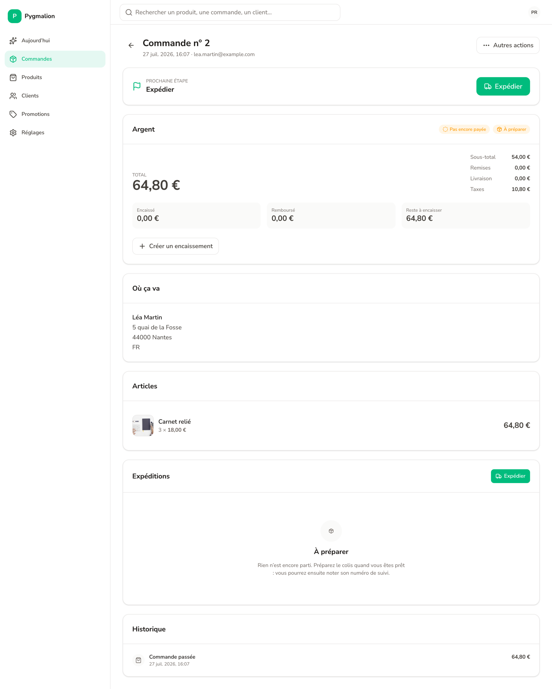

# Pygmalion

[](https://github.com/oumarbarry/pygmalion/actions/workflows/ci.yml)
[](https://www.npmjs.com/package/@oumarbarry/pygmalion)
[](LICENSE)

An ecommerce framework for Nuxt. Add one module to a Nuxt app and you have a
shop: the API, the admin, authentication for customers and staff, and a
migrated Postgres database. The feature set of Medusa v2 (catalog, pricing,
taxes, inventory, cart, promotions, shipping, payments, orders, returns,
exchanges, claims, draft orders) in a single Nuxt project, a single relational
schema, and one transaction per commerce operation.


## Why

Medusa v2 is complete, but it ships as a separate backend: its own modules,
link layer, workflow engine and React admin, with your Nuxt front end next to
it. Pygmalion composes the Nuxt ecosystem instead of reimplementing it. Nitro
serves the API, Drizzle holds one schema with real foreign keys, better-auth
handles both audiences (customers and staff), unstorage stores files. What is
left to write is the commerce itself.

In practice: `pnpm dev`, and you have a shop that sells. No Docker, no
Postgres to install. PGlite is embedded for development.

## Quick start

Requirements: Node 22 or newer and pnpm 12.

```bash
git clone https://github.com/oumarbarry/pygmalion.git
cd pygmalion
pnpm install
pnpm build      # builds the packages once
pnpm dev        # http://localhost:3648
```

On first start, a PGlite database is created under `apps/playground/.data/`,
the schema is pushed, and the demo shop is seeded: 20 products with photos,
2 collections, 5 categories, 2 regions (EUR and USD) with VAT and sales tax,
2 shipping options, 2 promotions. The catalog copy is seeded in English, or
in French with `DEMO_LOCALE=fr`.

The admin is at <http://localhost:3648/admin>, with a development account:

```
owner@pygmalion.dev / pygmalion
```

Place an order on the storefront, then ship it from the admin. The whole loop
takes two minutes.

## In your own Nuxt app

```bash
pnpm add @oumarbarry/pygmalion @oumarbarry/pygmalion-admin @nuxt/ui
```

```ts
// nuxt.config.ts
export default defineNuxtConfig({
  extends: ['@oumarbarry/pygmalion-admin'], // the admin layer, mounted on /admin
  modules: ['@oumarbarry/pygmalion'],        // API, auth, database
  routeRules: { '/admin/**': { ssr: false } },
})
```

`apps/playground/nuxt.config.ts` is the reference configuration. The
[getting started guide](docs/getting-started.md) goes from an empty database
to a paid and shipped order.

## The admin



The admin is not a copy of Medusa's. Navigation follows a merchant's tasks
(Today, Orders, Products, Customers, Promotions, Settings), composed
operations run as step-by-step wizards, and jargon stays out: you ship an
order, you do not "create a fulfillment". It works on a phone, in English or
in French.

## Packages

| Package | Role |
|---|---|
| `@oumarbarry/pygmalion` | The Nuxt module: 282 API routes, two auth instances, PGlite in development, migrations, mounts the admin. Ships the `pygmalion-migrate` CLI |
| `@oumarbarry/pygmalion-core` | Drizzle schema and domain services. Pure TypeScript, no Nuxt or h3 import |
| `@oumarbarry/pygmalion-admin` | The admin, a Nuxt layer (49 screens, Nuxt UI v4 in unstyled mode) |
| `@oumarbarry/pygmalion-sdk` | Typed HTTP client with zero dependencies, plus storefront composables |
| `@oumarbarry/pygmalion-stripe` | Stripe payment provider, and the reference example of a module |
| `apps/playground` | "Maison Pygmalion", the demo shop (English or French) and the E2E bench |

## How it is built

- One Postgres schema, 97 tables with real foreign keys. No module isolation,
  no link layer.
- One commerce operation is one transaction. Side effects (domain events,
  webhooks, notifications) are written to an `outbox` table inside the
  transaction and drained after commit. No external call inside an open
  transaction.
- Checkout: reservations and the pending order in one transaction, payment
  authorization outside it, then a second transaction finalizes or
  compensates. Capture happens at shipment by default.
- Money is an integer in minor units plus a currency code. Never a float.
- Customers and staff are two isolated better-auth instances. Staff sign-up
  closes after the first owner; the team grows by invitation. API keys for
  machine access.
- A module is an ordinary Nuxt module with five capabilities: extend the
  schema, register a provider (payment, tax, inventory, fulfillment,
  notification), serve routes, add admin pages, subscribe to domain events.
  See [extending](docs/extending.md).

## Documentation

| You want to | Read |
|---|---|
| Go from zero to your first sale | [docs/getting-started.md](docs/getting-started.md) |
| Write a module (schema, provider, routes, pages, events) | [docs/extending.md](docs/extending.md) |
| Deploy to production | [docs/deploy.md](docs/deploy.md) |
| Change the demo shop | [apps/playground/README.md](apps/playground/README.md) |

## What Pygmalion does not do

- Postgres only. No MySQL, no SQLite.
- One shop per installation. No multi-store.
- No workflow engine. A long, compensable operation beyond checkout is
  written by hand.
- Production migration is a schema push (drizzle-kit), with no migration
  history and no down step. Run it with `--dry-run` first, see
  [deploy](docs/deploy.md).
- No Stripe front end embedded: the server opens the PaymentIntent and
  returns its client secret, mounting the Payment Element is up to the
  storefront.
- The default notification provider writes to the database and sends
  nothing. Plugging in a transport is a ten-line module.
- English and French only, for the admin and the demo shop (English by
  default, French when the browser asks for it, switchable in both).
- No migration from Medusa.

## Development

```bash
pnpm install
pnpm build          # packages
pnpm typecheck
pnpm test           # unit suites (PGlite, no service to run)
pnpm test:e2e       # builds the playground and drives it over HTTP
```

See [CONTRIBUTING.md](CONTRIBUTING.md).

## License

MIT
